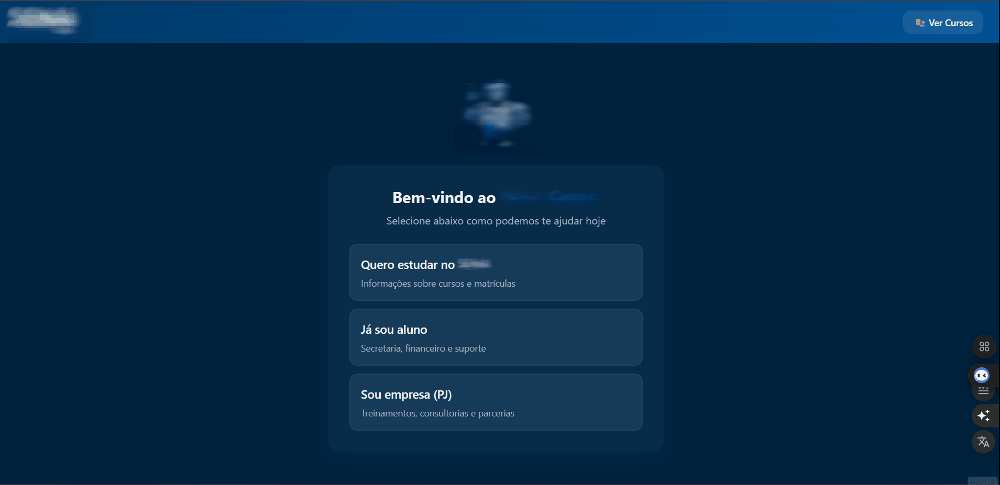
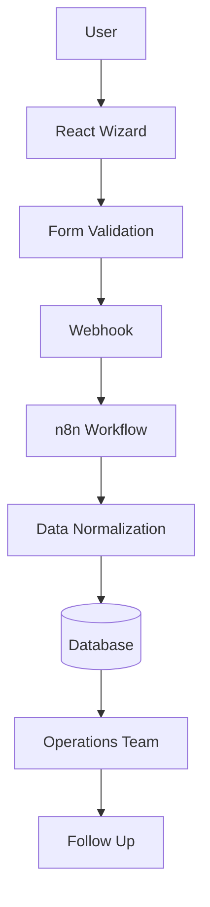

<p align="center">
  
</p>

<h1 align="center">LeadFlow Wizard</h1>

<p align="center">
  Intelligent Intake Automation System
</p>

<p align="center">
  Guided request flows • Workflow automation • Structured service intake
</p>

---

## 📋 Project Summary

| Attribute | Details |
|-----------|--------|
| Project | LeadFlow Wizard |
| Type | Intake Automation System |
| Frontend | React + Vite + TypeScript |
| UI | TailwindCSS + shadcn-ui + Framer Motion |
| Automation | n8n (Webhook workflows) |
| Data Layer | PostgreSQL / Supabase (conceptual) |
| Purpose | Structured request intake and routing |
| Status | Demo / Portfolio Project |

---

## 🎬 Demo

<p align="center">
  
</p>

The wizard guides users through structured service request flows and generates normalized payloads ready for automation pipelines.

---

## 🧠 Overview

Organizations frequently receive requests through unstructured channels such as contact forms, email, or messaging platforms. These entry points often produce inconsistent or incomplete information, creating operational friction.

**LeadFlow Wizard** introduces a guided intake layer that structures requests before they reach operational teams.

Key goals:

- reduce manual triage  
- standardize incoming request data  
- enable workflow automation  
- route requests to the correct operational teams  
- generate structured data for analytics  

---

## 🏗 System Architecture



### System Flow

1. User accesses the intake wizard  
2. Selects the request type  
3. Fills guided form fields  
4. Data is sent via webhook  
5. Automation engine processes the request  
6. Data is normalized  
7. Request is routed to the appropriate team  

---

## 🛠 Service Flows

The system supports three primary request flows.

### Flow A — New Lead / Interest

Captures users interested in services or educational programs.

**Collected fields**

- user status
- interest area
- name
- WhatsApp
- optional message

**Purpose**

- generate leads
- route requests to commercial teams

---

### Flow B — Active User Support

Support flow for users who already have an active relationship with the organization.

**Typical categories**

- financial
- administrative
- coordination

**Collected fields**

- name
- identifier
- contact information
- request description

**Purpose**

- route internal support requests to the appropriate department

---

### Flow C — Corporate Requests

Designed for companies requesting services.

**Typical services**

- training programs
- consulting
- internships
- technical services

**Collected fields**

- contact name
- company name
- company identifier
- request description

**Purpose**

- route corporate opportunities to business development teams

---

## 💻 Tech Stack

### Frontend

- React
- Vite
- TypeScript

### UI / Styling

- TailwindCSS
- shadcn-ui
- Framer Motion

### Automation Layer (Conceptual)

- n8n workflow engine
- webhook triggers
- automated routing
- request classification

### Data Layer (Conceptual)

- Supabase
- PostgreSQL
- structured request storage
- operational analytics

---
## 🚀 Run Locally

### Requirements

- Node.js (LTS recommended)
- npm or yarn

### Clone repository

```bash
git clone https://github.com/AndreGoncallez/leadflow-wizard-demo
```

### Enter project folder

```bash
cd leadflow-wizard-demo
```
### Install dependencies
```bash
npm install
```
## Configure webhook (optional)
   Create a .env file in the project root.
```bash
VITE_WEBHOOK_URL=https://your-endpoint.com/webhook
```
### Run development server
```bash
npm run dev
```
### Application runs at:
```bash
http://localhost:5173
```

## 📊 Example Payload

The wizard generates normalized JSON payloads ready for automation pipelines.
```bash
{
  "profile": "new_user",
  "user_status": "new",
  "interest_area": "Information Technology",
  "contact": {
    "name": "User Name",
    "whatsapp": "5500000000000"
  },
  "message": "Example message."
}
```
🔒 Security & Privacy

This repository is an anonymized demonstration environment for portfolio purposes.

Security guarantees:

no real personal data

no production endpoints

no API keys or credentials

automation workflows must be configured externally

📁 Project Structure
```bash
leadflow-wizard-demo
│
├── docs
│   ├── architecture.md
│   ├── data-model.md
│   └── security.md
│
├── screenshots
│
├── src
│
└── README.md
```
## 📈 Roadmap
### Phase 1 — Pilot

  - guided intake wizard

  - webhook integration

  - spreadsheet storage

### Phase 2 — Data Layer

  - Supabase integration

  - relational data modeling

### Phase 3 — Intelligence

  - automated request classification

  - operational dashboards

  - demand analytics

### Phase 4 — Production Readiness

  - input validation

  - anti-spam mechanisms

  - structured logging

  - operational observability

## 🎯 Portfolio Value

This project demonstrates engineering capabilities in:

  - workflow automation design

  - frontend system architecture

  - structured data pipelines

  - operational process design

  - scalable intake systems

## 👨‍💻 Author

Andre Goncallez
Automation • Infrastructure • Data-Driven Operations

GitHub
https://github.com/AndreGoncallez

LinkedIn
https://linkedin.com/in/andregoncallez

## 📄 License

This repository is shared for educational and portfolio purposes.

